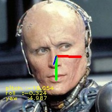
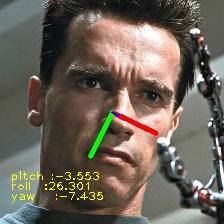

# hopenet_ncnn
**Hopenet** is an accurate and easy to use head pose estimation network. Models have been trained on the 300W-LP dataset and have been tested on real data with good qualitative performance. For details about the method and quantitative results please check the CVPR Workshop [paper](https://arxiv.org/abs/1710.00925).

**This implementation** is based on [Tencent NCNN](https://github.com/Tencent/ncnn) a high-performance neural network inference computing framework optimized for mobile platforms.

**Original PyTorch implementation:** https://github.com/natanielruiz/deep-head-pose

### Build ###

```bash
# build with cmake
cd hopenet_ncnn
mkdir build && cd build
cmake ..
make
```

### Test ###



```bash
# run test with
# ./hopenet_test [path_to_image] [optional_gpu_device_id]

(hopenet) nils@europa:~/hopenet_ncnn/build$ ./hopenet_test ../terminator.jpg

[0 GeForce GTX 1060 6GB]  queueC=2[8]  queueG=0[16]  queueT=1[2]
[0 GeForce GTX 1060 6GB]  buglssc=0  bugsbn1=0  buglbia=0  bugihfa=0
[0 GeForce GTX 1060 6GB]  fp16p=1  fp16s=1  fp16a=0  int8s=1  int8a=1
 with GPU_SUPPORT, selected gpu_device: 0
[X] 0 DISCRETE
```

### Acknowledgements ###

If you find Hopenet useful in your research please cite:

```
@InProceedings{Ruiz_2018_CVPR_Workshops,
author = {Ruiz, Nataniel and Chong, Eunji and Rehg, James M.},
title = {Fine-Grained Head Pose Estimation Without Keypoints},
booktitle = {The IEEE Conference on Computer Vision and Pattern Recognition (CVPR) Workshops},
month = {June},
year = {2018}
}
```